# Welcome to Front-End Development!

by @applecrazy, ITEC VP '16-17

​	Hi! I'm AppleCrazy *(an online alias)*! I'm the instructor for this course and also the creator of the ITEC website in its current form. When you first start this course and coding in general, you might be intimidated by the complex vocabulary, the abstract concepts, or the advanced math that you might need. You might also think that coding is for a select group of people (*nerds*, **cough cough**). However, most of these perceptions are false; while it is true you will need advanced math and vocabulary for more of the arcane topics in the world of programming (formal term for *coding*), you will do just fine for most tasks with math you already learned in fifth grade. Another thing I want you, the learner, to keep in mind is that **coding is for everyone**. Saying that coding is for nerds and geniuses is like saying learning English is only for liberal-arts majors, or that math is only for mathematicians. Learning to code is akin to learning a language–you need to learn the grammar of the language (coders call this *syntax*), vocabulary for that language (in code, these are *commands and statements*), and preferred word usage and sentence structure (also called *best practices*).

## About this Course

​	This course will cover the basics of what is called *front-end development*. By the end of this course, you will have your very own website with its own portfolio and blog, made all by yourself. In case you're wondering, having a website with your work is a **huge college app booster and a great career skill as well**. The blog you'll create *from scratch* is also a place where you can express your opinions on whatever you want. It's also a place to improve your writing skills for English or even to get feedback on your new artistic masterpiece! In addition, you can use these skills to create websites for whatever you please–from club websites to a school project!

## How this Course is Structured

​	Most of this course will be independent and on your own time. The beauty of this is that you can learn whenever you have a few minutes to spare. If you need help, though, either email me through the email in the footer of this website or attend in-person sessions. For a list of these, visit our events page in the top bar. In addition, all the projects and exercises will be "graded" electronically by me or one of the other ITEC officers. (The grading is really just feedback on your code.) Also, **this course is ungraded and you will not lose anything if you don't finish.** However, there are many perks to finishing this course:

1. You will get **a course completion certificate.**
2. You'll **get priority when saving your spot in certain ITEC sessions and events.**
3. ITEC officers are **more likely to nominate and/or elect you** to be part of our leadership team.
4. Plus, you get to **boost your college app with a website you can show off.**

## Getting Set Up

Similar to how you need pencils and paper for school, you need some tools to get started with front-end development. Follow the guide below to get set up.

### Creating a GitHub Account

The first thing we need to do is create a GitHub account. GitHub is a place to store your code and is also what we will use to host our website. The free plan allows you to create unlimited "repositories" (kind of like buckets for your code) and gives you one free website.

To create a GitHub account, go to [github.com/join](https://github.com/join). Fill in all the relevant information and click **Create an account**.

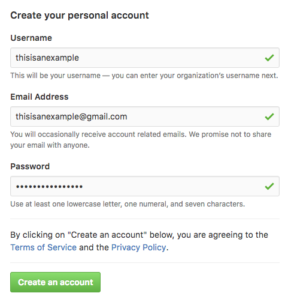

Select the Free plan and click **Continue**.

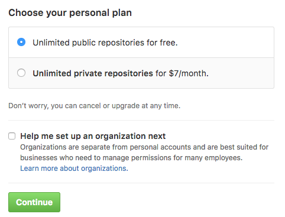

If you want, you can fill out the survey that comes next, but I'll just click **Skip this step**.

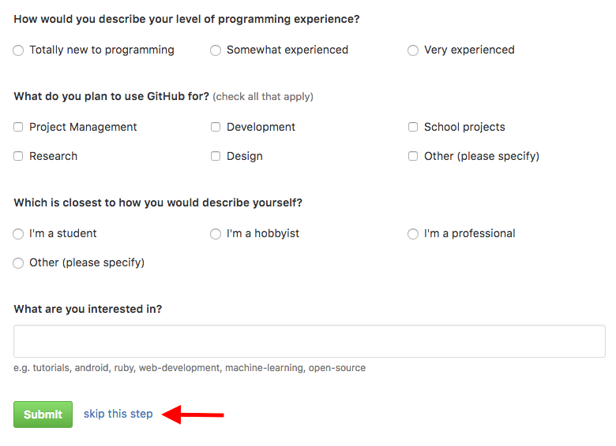

Next, go to your email and verify your account.

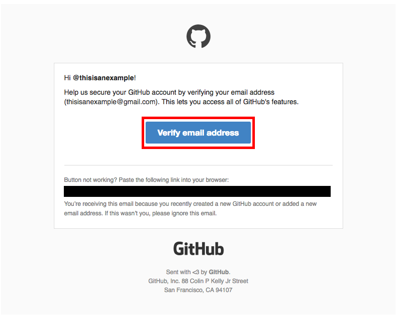

Congratulations! You now have a GitHub account! We'll use this a lot when creating your website.

### Creating a Codeanywhere Account

​	Codeanywhere is a service which provides free "virtual machines" in the cloud. These are essentially like computers that you can access from your web browser, and this is where you will store all your website's files and also where you'll work on the code for your website. 

To create a Codeanywhere account, go to [https://codeanywhere.com](https://codeanywhere.com) and click on the little GitHub icon.

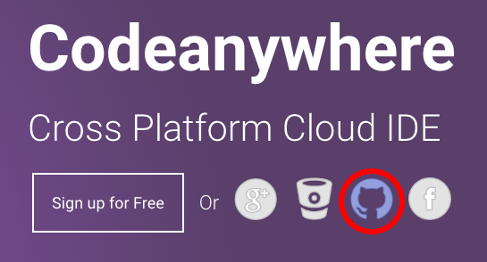

Follow the prompt to connect Codeanywhere to your account.

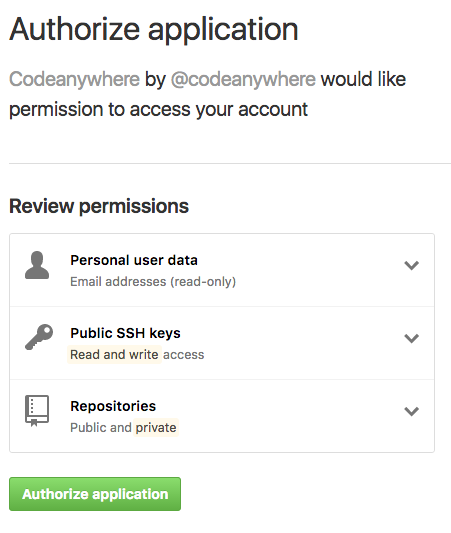

Next, the environment will load and the **Connection Wizard** will appear. In the pane on the left, select **Container**. Then name your workspace (it can be called whatever you wish). In the box in the middle of the Connection Wizard, you will see a bunch of weird looking names and descriptions. Scroll down until you find the one that is highlighted in the diagram below. Make sure it says `Ubuntu` and not `Centos` in the right column. Finally, click **Create**.

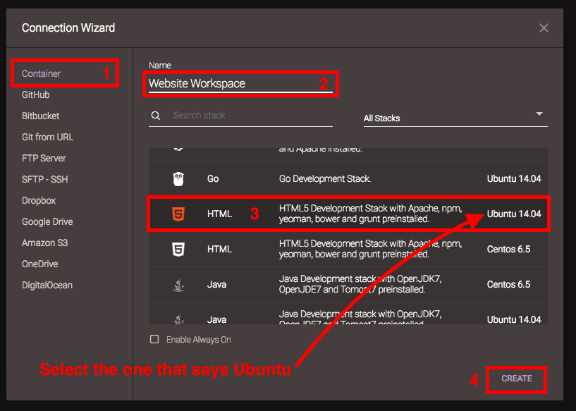

Then, the service will get busy configuring your virtual computer and display the following dialog box while it is busy:

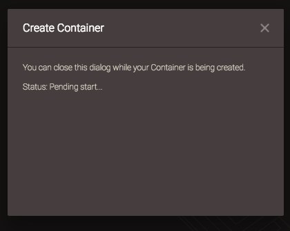

After this dialog disappears, right click on the workspace you just created and named in the left pane and click **Create File**.

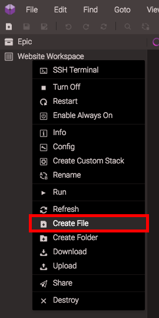

Name this file `index.html` and click OK.

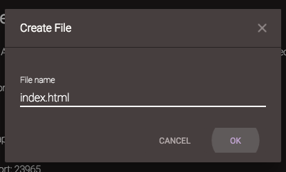

In this file, simply type the words `It works!` and save by going to **File > Save**.

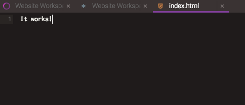

Then, go to the tab with the star icon and click the link under `To access an application…`

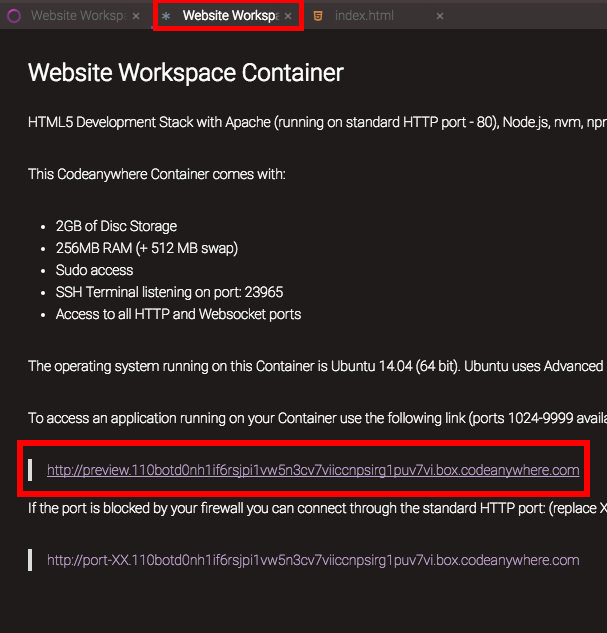

Your web browser will then open a webpage that should say the words you typed in the file. If so, you have successfully set up your online code-writing environment! Congratulations!

## Conclusion

In this lesson, you learned:

- Why coding is so important
- How to create a GitHub account
- How to set up your development environment

You're now well on your way to becoming a front-end developer! In the next lesson, we'll actually get started learning HTML, the markup language used to structure web pages.

## Exercises

1. Open up the `index.html` file that we created and change the text. See if it updates after saving and opening the link again.

Lesson © 2016 AppleCrazy. All rights reserved.

