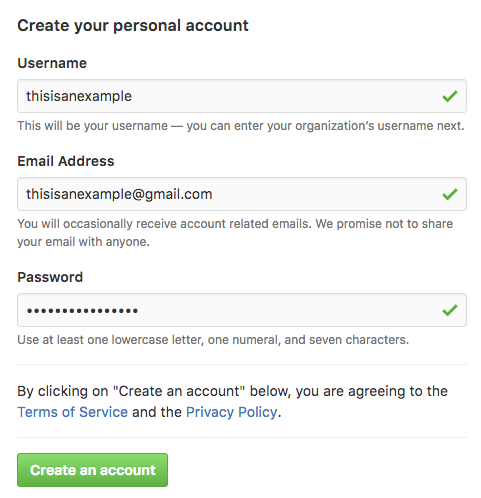
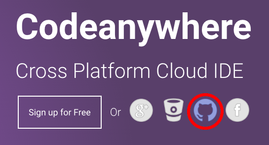
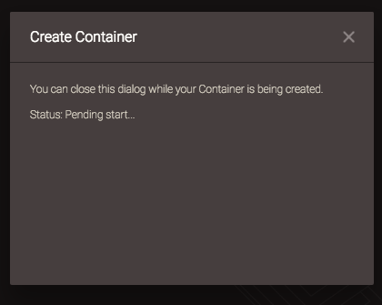

# Introduction to HTML

by @applecrazy, ITEC VP '16-17

​	Now that you've finally set yourself up for success, let's dive right into the juicy parts of the course! In this lesson, you'll get a basic understanding of HTML to create the structure of your HTML page. To make things easier, we'll use CodePen (an online playground) to experiment and design. Codeanywhere will mainly be used to deploy your final website. Simply sign up for a free account at [codepen.io/signup/free](https://codepen.io/signup/free). 

.Click on the  icon and title it "`Intro to HTML`" using the pencil icon at the top left of the app.  Now you're ready to begin!

## How do you create a webpage?

​	To help explain this better, compare creating a good webpage similar to building a house. HTML is the structure of your "house," boards, foundation and all. Now since nobody enjoys living in just a bare, unstylized house, you need to bring in some décor and style. (Thankfully, styling webpages isn't nearly as hard as making a house look perfect.) In order to style your webpage, you use something called CSS (**C**ascading **S**tyle **S**heets), which is essentially a text file containing rules on how each part of your webpage should be styled. Finally, a house isn't complete with running water, electricity, and appliances. This interactivity is accomplished with JavaScript, which allows you to change your webpage based on certain conditions and create cool animations. In this lesson we'll scratch the surface of HTML (since there are many different components built right in) and also provide you with the resources to go out and learn even more on your own. If you're ever stuck, just come to an ITEC meeting for assistance or email us (the address is in the footer of this page).

Okay, enough talk–let's actually start coding!

## How to Eat Food 

## Getting Set Up

Similar to how you need pencils and paper for school, you need some tools to get started with front-end development. Follow the guide below to get set up.

### Creating a GitHub Account

The first thing we need to do is create a GitHub account. GitHub is a place to store your code and is also what we will use to host our website. The free plan allows you to create unlimited "repositories" (kind of like buckets for your code) and gives you one free website.

To create a GitHub account, go to [github.com/join](https://github.com/join). Fill in all the relevant information and click **Create an account**.

Select the Free plan and click **Continue**.

If you want, you can fill out the survey that comes next, but I'll just click **Skip this step**.

Next, go to your email and verify your account.

Congratulations! You now have a GitHub account! We'll use this a lot when creating your website.

### Creating a Codeanywhere Account

​	Codeanywhere is a service which provides free "virtual machines" in the cloud. These are essentially like computers that you can access from your web browser, and this is where you will store all your website's files and also where you'll work on the code for your website. 

To create a Codeanywhere account, go to [https://codeanywhere.com](https://codeanywhere.com) and click on the little GitHub icon.

Follow the prompt to connect Codeanywhere to your account.

Next, the environment will load and the **Connection Wizard** will appear. In the pane on the left, select **Container**. Then name your workspace (it can be called whatever you wish). In the box in the middle of the Connection Wizard, you will see a bunch of weird looking names and descriptions. Scroll down until you find the one that is highlighted in the diagram below. Make sure it says `Ubuntu` and not `Centos` in the right column. Finally, click **Create**.

Then, the service will get busy configuring your virtual computer and display the following dialog box while it is busy:

After this dialog disappears, right click on the workspace you just created and named in the left pane and click **Create File**.

Name this file `index.html` and click OK.

In this file, simply type the words `It works!` and save by going to **File > Save**.

Then, go to the tab with the star icon and click the link under `To access an application…`

Your web browser will then open a webpage that should say the words you typed in the file. If so, you have successfully set up your online code-writing environment! Congratulations!

## Conclusion

In this lesson, you learned:

- Why coding is so important
- How to create a GitHub account
- How to set up your development environment

You're now well on your way to becoming a front-end developer! In the next lesson, we'll actually get started learning HTML, the markup language used to structure web pages.

## Exercises

1. Open up the `index.html` file that we created and change the text. See if it updates after saving and opening the link again.

Lesson © 2016 AppleCrazy. All rights reserved.
